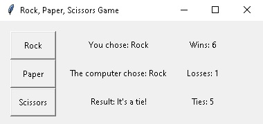

# Rock-Paper-Scissors-Game
A GUI based Python implementation of the "Rock, Paper, Scissors Game"

## Dependencies
1. Git - https://git-scm.com/downloads
2. Python - https://www.python.org/downloads/

## Installation
1. Choose a folder where to download it
2. Open Git Bash in it
3. Type or copy & paste: git clone https://github.com/iivanov444/Rock-Paper-Scissors-Game

## Usage
Open Terminal(Windows: PowerShell, Linux: Bash, MacOS: Terminal)
and type or copy & paste: python main_program.py

## Features
GUI and wins, losses, ties counter

## Examples
Run the program and an interactive GUI will pop up

## License
MIT License
